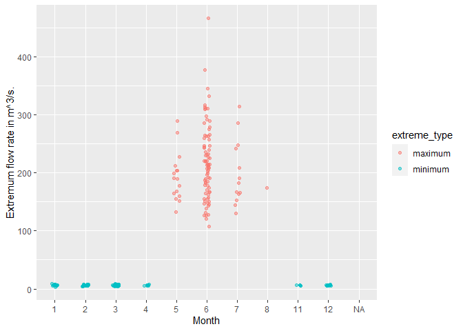

Mini Data-Analysis Deliverable 1
================
Eve Chen
09/10/2021

# Welcome to my first data analysis project!

Let’s load the packages below.

``` r
library(datateachr)
library(tidyverse)
```

# Task 1: Choose your favorite dataset (10 points)

The `datateachr` package by Hayley Boyce and Jordan Bourak currently
composed of 7 semi-tidy datasets for educational purposes. Here is a
brief description of each dataset:

-   *apt\_buildings*: Acquired courtesy of The City of Toronto’s Open
    Data Portal. It currently has 3455 rows and 37 columns.

-   *building\_permits*: Acquired courtesy of The City of Vancouver’s
    Open Data Portal. It currently has 20680 rows and 14 columns.

-   *cancer\_sample*: Acquired courtesy of UCI Machine Learning
    Repository. It currently has 569 rows and 32 columns.

-   *flow\_sample*: Acquired courtesy of The Government of Canada’s
    Historical Hydrometric Database. It currently has 218 rows and 7
    columns.

-   *parking\_meters*: Acquired courtesy of The City of Vancouver’s Open
    Data Portal. It currently has 10032 rows and 22 columns.

-   *steam\_games*: Acquired courtesy of Kaggle. It currently has 40833
    rows and 21 columns.

-   *vancouver\_trees*: Acquired courtesy of The City of Vancouver’s
    Open Data Portal. It currently has 146611 rows and 20 columns.

**1.1** Out of the 7 datasets available in the `datateachr` package,
choose **4** that appeal to you based on their description. Write your
choices below:

1: *apt\_buildings*  
2: *cancer\_sample*  
3: *flow\_sample*  
4: *steam\_games*

**1.2** One way to narrowing down your selection is to *explore* the
datasets. Use your knowledge of dplyr to find out at least *3*
attributes about each of these datasets (an attribute is something such
as number of rows, variables, class type…). The goal here is to have an
idea of *what the data looks like*.

*Hint:* This is one of those times when you should think about the
cleanliness of your analysis. I added a single code chunk for you, but
do you want to use more than one? Would you like to write more comments
outside of the code chunk?

**Exploring dataset 1: *apt\_buildings***

``` r
### Class of the dataset ###
class(apt_buildings)
```

    ## [1] "tbl_df"     "tbl"        "data.frame"

``` r
### Get a glimpse of the data ###
glimpse(apt_buildings)
```

    ## Rows: 3,455
    ## Columns: 37
    ## $ id                               <dbl> 10359, 10360, 10361, 10362, 10363, 10~
    ## $ air_conditioning                 <chr> "NONE", "NONE", "NONE", "NONE", "NONE~
    ## $ amenities                        <chr> "Outdoor rec facilities", "Outdoor po~
    ## $ balconies                        <chr> "YES", "YES", "YES", "YES", "NO", "NO~
    ## $ barrier_free_accessibilty_entr   <chr> "YES", "NO", "NO", "YES", "NO", "NO",~
    ## $ bike_parking                     <chr> "0 indoor parking spots and 10 outdoo~
    ## $ exterior_fire_escape             <chr> "NO", "NO", "NO", "YES", "NO", NA, "N~
    ## $ fire_alarm                       <chr> "YES", "YES", "YES", "YES", "YES", "Y~
    ## $ garbage_chutes                   <chr> "YES", "YES", "NO", "NO", "NO", "NO",~
    ## $ heating_type                     <chr> "HOT WATER", "HOT WATER", "HOT WATER"~
    ## $ intercom                         <chr> "YES", "YES", "YES", "YES", "YES", "Y~
    ## $ laundry_room                     <chr> "YES", "YES", "YES", "YES", "YES", "Y~
    ## $ locker_or_storage_room           <chr> "NO", "YES", "YES", "YES", "NO", "YES~
    ## $ no_of_elevators                  <dbl> 3, 3, 0, 1, 0, 0, 0, 2, 4, 2, 0, 2, 2~
    ## $ parking_type                     <chr> "Underground Garage , Garage accessib~
    ## $ pets_allowed                     <chr> "YES", "YES", "YES", "YES", "YES", "Y~
    ## $ prop_management_company_name     <chr> NA, "SCHICKEDANZ BROS. PROPERTIES", N~
    ## $ property_type                    <chr> "PRIVATE", "PRIVATE", "PRIVATE", "PRI~
    ## $ rsn                              <dbl> 4154812, 4154815, 4155295, 4155309, 4~
    ## $ separate_gas_meters              <chr> "NO", "NO", "NO", "NO", "NO", "NO", "~
    ## $ separate_hydro_meters            <chr> "YES", "YES", "YES", "YES", "YES", "Y~
    ## $ separate_water_meters            <chr> "NO", "NO", "NO", "NO", "NO", "NO", "~
    ## $ site_address                     <chr> "65  FOREST MANOR RD", "70  CLIPPER R~
    ## $ sprinkler_system                 <chr> "YES", "YES", "NO", "YES", "NO", "NO"~
    ## $ visitor_parking                  <chr> "PAID", "FREE", "UNAVAILABLE", "UNAVA~
    ## $ ward                             <chr> "17", "17", "03", "03", "02", "02", "~
    ## $ window_type                      <chr> "DOUBLE PANE", "DOUBLE PANE", "DOUBLE~
    ## $ year_built                       <dbl> 1967, 1970, 1927, 1959, 1943, 1952, 1~
    ## $ year_registered                  <dbl> 2017, 2017, 2017, 2017, 2017, NA, 201~
    ## $ no_of_storeys                    <dbl> 17, 14, 4, 5, 4, 4, 4, 7, 32, 4, 4, 7~
    ## $ emergency_power                  <chr> "NO", "YES", "NO", "NO", "NO", "NO", ~
    ## $ `non-smoking_building`           <chr> "YES", "NO", "YES", "YES", "YES", "NO~
    ## $ no_of_units                      <dbl> 218, 206, 34, 42, 25, 34, 14, 105, 57~
    ## $ no_of_accessible_parking_spaces  <dbl> 8, 10, 20, 42, 12, 0, 5, 1, 1, 6, 12,~
    ## $ facilities_available             <chr> "Recycling bins", "Green Bin / Organi~
    ## $ cooling_room                     <chr> "NO", "NO", "NO", "NO", "NO", "NO", "~
    ## $ no_barrier_free_accessible_units <dbl> 2, 0, 0, 42, 0, NA, 14, 0, 0, 1, 25, ~

**Attributes about *apt\_buildings* include:**

-   Class of the dataset: `c("tbl_df", "tbl", "data.frame")`, which
    means it is a tibble that has been coerced from a dataframe.
-   Number of rows: 3455
-   Number of columns: 37
-   Types of data in columns: 9 numeric types, 28 character types.
-   Columns names
-   Contents of variables in each column

**Comments for *apt\_buildings* :**

-   This dataset consists of different building information of 3455
    apartments, including the year they were built and registered,
    number of units, facility conditions and so on.
-   Some columns that are `character` type only consist of 2 factors as
    “YES” or “NO”.
-   It’s possible that we can use it to study the relationship between
    the age of the buildings and the characteristics.

**Exploring dataset 2: *cancer\_sample***

``` r
### Class of the dataset ###
class(cancer_sample)
```

    ## [1] "spec_tbl_df" "tbl_df"      "tbl"         "data.frame"

``` r
### Get a glimpse of the data ###
glimpse(cancer_sample)
```

    ## Rows: 569
    ## Columns: 32
    ## $ ID                      <dbl> 842302, 842517, 84300903, 84348301, 84358402, ~
    ## $ diagnosis               <chr> "M", "M", "M", "M", "M", "M", "M", "M", "M", "~
    ## $ radius_mean             <dbl> 17.990, 20.570, 19.690, 11.420, 20.290, 12.450~
    ## $ texture_mean            <dbl> 10.38, 17.77, 21.25, 20.38, 14.34, 15.70, 19.9~
    ## $ perimeter_mean          <dbl> 122.80, 132.90, 130.00, 77.58, 135.10, 82.57, ~
    ## $ area_mean               <dbl> 1001.0, 1326.0, 1203.0, 386.1, 1297.0, 477.1, ~
    ## $ smoothness_mean         <dbl> 0.11840, 0.08474, 0.10960, 0.14250, 0.10030, 0~
    ## $ compactness_mean        <dbl> 0.27760, 0.07864, 0.15990, 0.28390, 0.13280, 0~
    ## $ concavity_mean          <dbl> 0.30010, 0.08690, 0.19740, 0.24140, 0.19800, 0~
    ## $ concave_points_mean     <dbl> 0.14710, 0.07017, 0.12790, 0.10520, 0.10430, 0~
    ## $ symmetry_mean           <dbl> 0.2419, 0.1812, 0.2069, 0.2597, 0.1809, 0.2087~
    ## $ fractal_dimension_mean  <dbl> 0.07871, 0.05667, 0.05999, 0.09744, 0.05883, 0~
    ## $ radius_se               <dbl> 1.0950, 0.5435, 0.7456, 0.4956, 0.7572, 0.3345~
    ## $ texture_se              <dbl> 0.9053, 0.7339, 0.7869, 1.1560, 0.7813, 0.8902~
    ## $ perimeter_se            <dbl> 8.589, 3.398, 4.585, 3.445, 5.438, 2.217, 3.18~
    ## $ area_se                 <dbl> 153.40, 74.08, 94.03, 27.23, 94.44, 27.19, 53.~
    ## $ smoothness_se           <dbl> 0.006399, 0.005225, 0.006150, 0.009110, 0.0114~
    ## $ compactness_se          <dbl> 0.049040, 0.013080, 0.040060, 0.074580, 0.0246~
    ## $ concavity_se            <dbl> 0.05373, 0.01860, 0.03832, 0.05661, 0.05688, 0~
    ## $ concave_points_se       <dbl> 0.015870, 0.013400, 0.020580, 0.018670, 0.0188~
    ## $ symmetry_se             <dbl> 0.03003, 0.01389, 0.02250, 0.05963, 0.01756, 0~
    ## $ fractal_dimension_se    <dbl> 0.006193, 0.003532, 0.004571, 0.009208, 0.0051~
    ## $ radius_worst            <dbl> 25.38, 24.99, 23.57, 14.91, 22.54, 15.47, 22.8~
    ## $ texture_worst           <dbl> 17.33, 23.41, 25.53, 26.50, 16.67, 23.75, 27.6~
    ## $ perimeter_worst         <dbl> 184.60, 158.80, 152.50, 98.87, 152.20, 103.40,~
    ## $ area_worst              <dbl> 2019.0, 1956.0, 1709.0, 567.7, 1575.0, 741.6, ~
    ## $ smoothness_worst        <dbl> 0.1622, 0.1238, 0.1444, 0.2098, 0.1374, 0.1791~
    ## $ compactness_worst       <dbl> 0.6656, 0.1866, 0.4245, 0.8663, 0.2050, 0.5249~
    ## $ concavity_worst         <dbl> 0.71190, 0.24160, 0.45040, 0.68690, 0.40000, 0~
    ## $ concave_points_worst    <dbl> 0.26540, 0.18600, 0.24300, 0.25750, 0.16250, 0~
    ## $ symmetry_worst          <dbl> 0.4601, 0.2750, 0.3613, 0.6638, 0.2364, 0.3985~
    ## $ fractal_dimension_worst <dbl> 0.11890, 0.08902, 0.08758, 0.17300, 0.07678, 0~

**Attributes about *cancer\_sample* include:**

-   Class of the dataset:
    `c("spec_tbl_df", tbl_df", "tbl", "data.frame")`, as a tibble
    subclass.
-   Number of rows: 569
-   Number of columns: 32
-   Types of data in columns: 31 numeric types, 1 character types
    (`diagnosis`).
-   Columns names
-   Contents of variables in each column

**Comments for *cancer\_sample*:**

-   The `spec_tbl_df` subclass is new and special to me. According to a
    documentation, it “differs from a regular tibble only in that the
    `spec` attribute (which holds the column specification) is lost as
    soon as the object is subset and a normal `tbl_df` object is
    returned.”
-   This dataset includes 569 observations of diagnostic cancer data.
-   Besides the ID of samples and the ultimate diagnosis of the breast
    mass (“M” = malignant, “B” = benign), the columns are mostly
    **quantitative features** derived from the sample image.
-   Both statistic and clinical knowledge might be required to
    understand the variables and decide the ways to analyze and
    interpret the data.

**Exploring dataset 3: *flow\_sample***

``` r
### Class of the dataset ###
class(flow_sample)
```

    ## [1] "tbl_df"     "tbl"        "data.frame"

``` r
### Get a glimpse of the data ###
glimpse(flow_sample)
```

    ## Rows: 218
    ## Columns: 7
    ## $ station_id   <chr> "05BB001", "05BB001", "05BB001", "05BB001", "05BB001", "0~
    ## $ year         <dbl> 1909, 1910, 1911, 1912, 1913, 1914, 1915, 1916, 1917, 191~
    ## $ extreme_type <chr> "maximum", "maximum", "maximum", "maximum", "maximum", "m~
    ## $ month        <dbl> 7, 6, 6, 8, 6, 6, 6, 6, 6, 6, 6, 7, 6, 6, 6, 7, 5, 7, 6, ~
    ## $ day          <dbl> 7, 12, 14, 25, 11, 18, 27, 20, 17, 15, 22, 3, 9, 5, 14, 5~
    ## $ flow         <dbl> 314, 230, 264, 174, 232, 214, 236, 309, 174, 345, 185, 24~
    ## $ sym          <chr> NA, NA, NA, NA, NA, NA, NA, NA, NA, NA, NA, NA, NA, NA, N~

**Attributes about *flow\_sample* include:**

-   Class of the dataset: `c("tbl_df", "tbl", "data.frame")`, which
    means it is a tibble that has been coerced from a dataframe.
-   Number of rows: 218
-   Number of columns: 7
-   Types of data in columns: 4 numeric types, 3 character types.
-   Columns names
-   Contents of variables in each column

**Comments for *flow\_sample*:**

-   This dataset includes 218 observations of flow rate extrema data and
    additional information regarding the date and conditions of data
    collection.
-   If we see the `extreme_type` and the flow rate `flow` as dependent
    variable and the others as possible factors, we can have multiple
    angles to study the relationship between them by correlations.

**Exploring dataset 4: *steam\_games***

``` r
### Class of the dataset ###
class(steam_games)
```

    ## [1] "spec_tbl_df" "tbl_df"      "tbl"         "data.frame"

``` r
### Get a glimpse of the data ###
glimpse(steam_games)
```

    ## Rows: 40,833
    ## Columns: 21
    ## $ id                       <dbl> 1, 2, 3, 4, 5, 6, 7, 8, 9, 10, 11, 12, 13, 14~
    ## $ url                      <chr> "https://store.steampowered.com/app/379720/DO~
    ## $ types                    <chr> "app", "app", "app", "app", "app", "bundle", ~
    ## $ name                     <chr> "DOOM", "PLAYERUNKNOWN'S BATTLEGROUNDS", "BAT~
    ## $ desc_snippet             <chr> "Now includes all three premium DLC packs (Un~
    ## $ recent_reviews           <chr> "Very Positive,(554),- 89% of the 554 user re~
    ## $ all_reviews              <chr> "Very Positive,(42,550),- 92% of the 42,550 u~
    ## $ release_date             <chr> "May 12, 2016", "Dec 21, 2017", "Apr 24, 2018~
    ## $ developer                <chr> "id Software", "PUBG Corporation", "Harebrain~
    ## $ publisher                <chr> "Bethesda Softworks,Bethesda Softworks", "PUB~
    ## $ popular_tags             <chr> "FPS,Gore,Action,Demons,Shooter,First-Person,~
    ## $ game_details             <chr> "Single-player,Multi-player,Co-op,Steam Achie~
    ## $ languages                <chr> "English,French,Italian,German,Spanish - Spai~
    ## $ achievements             <dbl> 54, 37, 128, NA, NA, NA, 51, 55, 34, 43, 72, ~
    ## $ genre                    <chr> "Action", "Action,Adventure,Massively Multipl~
    ## $ game_description         <chr> "About This Game Developed by id software, th~
    ## $ mature_content           <chr> NA, "Mature Content Description  The develope~
    ## $ minimum_requirements     <chr> "Minimum:,OS:,Windows 7/8.1/10 (64-bit versio~
    ## $ recommended_requirements <chr> "Recommended:,OS:,Windows 7/8.1/10 (64-bit ve~
    ## $ original_price           <dbl> 19.99, 29.99, 39.99, 44.99, 0.00, NA, 59.99, ~
    ## $ discount_price           <dbl> 14.99, NA, NA, NA, NA, 35.18, 70.42, 17.58, N~

**Attributes about *steam\_games*:**

-   Class of the dataset:
    `c("spec_tbl_df", tbl_df", "tbl", "data.frame")`, as a tibble
    subclass.
-   Number of rows: 40833
-   Number of columns: 21
-   Types of data in columns: 4 numeric types, 17 character types.
-   Columns names
-   Contents of variables in each column

**Comments for *steam\_games*:**

-   It has 40833 observations, which is the most out of the 4 datasets
    that I’ve chosen.
-   The columns of this set contains free text information as the url,
    names, developer and other details of the games. There’s also common
    features across them that can be summarized, such as `types` and
    `genre`. There are also numeric features like `achivements` and
    `price` that seem interesting.

**1.3** Now that you’ve explored the 4 datasets that you were initially
most interested in, let’s narrow it down to 2. What lead you to choose
these 2? Briefly explain your choices below, and feel free to include
any code in your explanation.

**My two choices and explanation:**

-   The *flow\_sample* dataset:

The variables in each column of this dataset is well organized (formats
are uniformed for each observation) and easy to understand. I thought of
some questions that can possibly be answered by analyzing these data at
first glance. I think it would be interesting for me to learn about the
fluctuation of minimum and maximum flow rate and how that changes from
year to year and if our treatment of the environment and global warming
has changed this throughout the years.

-   The *steam\_games* dataset:

First of all, I like Steam and this dataset looks fun. And as I
mentioned above I was interested by the class of this dataset
`spec_tbl_df`, as we didn’t seem to cover this in class. Even though the
information in many columns looks kind of messy and hard to deal with, I
would still want to study the relationship between the reviews,
achievements and the price difference of the games.

**1.4** Time for the final decision! Going back to the beginning, it’s
important to have an *end goal* in mind. For example, if I had chosen
the `titanic` dataset for my project, I might’ve wanted to explore the
relationship between survival and other variables. Try to think of 1
research question that you would want to answer with each dataset. Note
them down below, and make your final choice based on what seems more
interesting to you!

**Research questions for each dataset:**

1.  *apt\_buildings*: I want to study the distribution of types of
    heating systems (`heating_type`) for buildings built in different
    year (`year_built`). I was assuming that the older buildings are
    using hot water and the newer ones tend to use electric or forced
    air gas systems.

2.  *cancer\_sample*: I would be interested in the general range of the
    data like `radius_mean`, `texture_mean` and `area mean` where the
    sample can be diagnosed accordingly as benign `B` or malignant `M`.

3.  *flow\_sample*: I want to explore the relationship between extremum
    flow rate (`flow`) and other variables of time and conditions. For
    example, I want to see if there are year by year long term changes
    of the extremum flow rate, or if there are days in a month or months
    in a year when maximum or minimum flow rates (`extreme_type`)
    commonly occur.

4.  *steam\_games*: I want to study the common differences (extreme
    value or portion) between `original_price` and `discount_price` so
    it would be convenient to make a prediction in the future. Also we
    can study the relationship between this differences and the
    `achievements` that the games made.

**My final choice: *flow\_sample***

They all look interesting to me. But based on the simple inspection of
the datasets, I’m more confident in *flow\_sample* since its data looks
more organized and clean - it has less `NA` values and less variables
that seem hard to be factored or quantified.

# Task 2: Exploring your dataset (15 points)

If we rewind and go back to the learning objectives, you’ll see that by
the end of this deliverable, you should have formulated *4* research
questions about your data that you may want to answer during your
project. However, it may be handy to do some more exploration on your
dataset of choice before creating these questions - by looking at the
data, you may get more ideas. **Before you start this task, read all
instructions carefully until you reach START HERE**.

2.1 Complete *4 out of the following 8 exercises* to dive deeper into
your data. All datasets are different and therefore, not all of these
tasks may make sense for your data - which is why you should only answer
*4*. Use *dplyr* and *ggplot*.

1.  **Plot the distribution of a numeric variable.**
2.  Create a new variable based on other variables in your data (only if
    it makes sense)
3.  Investigate how many missing values there are per variable. Can you
    find a way to plot this?
4.  **Explore the relationship between 2 variables in a plot.**
5.  **Filter observations in your data according to your own criteria.**
    Think of what you’d like to explore - again, if this was the
    `titanic` dataset, I may want to narrow my search down to passengers
    born in a particular year…
6.  **Use a boxplot to look at the frequency of different observations
    within a single variable. You can do this for more than one variable
    if you wish!**
7.  Make a new tibble with a subset of your data, with variables and
    observations that you are interested in exploring.
8.  Use a density plot to explore any of your variables (that are
    suitable for this type of plot).

2.2 For each of the 4 exercises that you complete, provide a *brief
explanation* of why you chose that exercise in relation to your data (in
other words, why does it make sense to do that?), and sufficient
comments for a reader to understand your reasoning and code.

# Task 3: Write your research questions (5 points)

So far, you have chosen a dataset and gotten familiar with it through
exploring the data. Now it’s time to figure out 4 research questions
that you would like to answer with your data! Write the 4 questions and
any additional comments at the end of this deliverable. These questions
are not necessarily set in stone - TAs will review them and give you
feedback; therefore, you may choose to pursue them as they are for the
rest of the project, or make modifications!

<!--- *****START HERE***** --->

# Task 2: Exploring *flow\_sample*:

#### 1. Plot the distribution of a numeric variable.

First, I want to explore the distribution of the flow rate (`flow`).
This is one of the most informative variable from this dataset so
knowing its range and distribution would help with the following tests.

``` r
### Make a histogram of flow, have the height of the bars represent the density, and distinguish extreme_type by colour
flow_sample %>% 
  ggplot(aes(x = flow, y = ..density..)) +
   geom_histogram(aes(fill = extreme_type), bins = 10, na.rm = T) + 
   # There are 2 NA values in this dataset. I investigated and decided to remove them when making plots 
   labs(x = "Extremum flow rate in m^3/s.")
```

<!-- -->

From this histogram, we can see that:

-   Most of the extremum flow rate value recorded is around `0 m^3/s`,
    and they are all records for the minimum flow of each year.
-   For the maximum record, bars with the most frequencies are between
    flow rate `150 - 350 m^3/s`. There are very few cases where the flow
    rate is around `450 m^3s`, the highest of all.

#### 4. Explore the relationship between 2 variables in a plot.

After the first histogram, I really want to know if they record the
minimum and maximum rate in certain time. I would use `jitterplot` to
explore how `flow` rate is spread in each `month`.

``` r
### Make a jitter plot of flow and month, and distinguish extreme_type by colour
flow_sample %>% 
  ggplot(aes(as.factor(month), flow, color = extreme_type)) + 
    geom_jitter(alpha = 0.5, width = 0.1, na.rm = T) +
    labs(x = "Month", y = "Extremum flow rate in m^3/s.")
```

<!-- -->

-   From this plot, it’s obvious that the maximum flow is usually
    collected between May to July. And the minimum flow can be collected
    in other months.
-   The highest extreme flow rate is collected in June.

#### 5. Filter observations in your data according to your own criteria.

Now I want to investigate further on specifically what day in a month
would the `maximum` rate usually occur and be recorded. For this, I want
to narrow my search down to records of `maximum` flow and all the
corresponding information.

``` r
### Create a subset that only looks at observations when maximum flow per year was recorded
flow_sample_max <-
  flow_sample %>% 
  filter(extreme_type == "maximum")
### Take a look at the new subset
head(flow_sample_max)
```

    ## # A tibble: 6 x 7
    ##   station_id  year extreme_type month   day  flow sym  
    ##   <chr>      <dbl> <chr>        <dbl> <dbl> <dbl> <chr>
    ## 1 05BB001     1909 maximum          7     7   314 <NA> 
    ## 2 05BB001     1910 maximum          6    12   230 <NA> 
    ## 3 05BB001     1911 maximum          6    14   264 <NA> 
    ## 4 05BB001     1912 maximum          8    25   174 <NA> 
    ## 5 05BB001     1913 maximum          6    11   232 <NA> 
    ## 6 05BB001     1914 maximum          6    18   214 <NA>

``` r
### Check the size of the new subset
dim(flow_sample_max)
```

    ## [1] 109   7

-   The subset is narrowed down to `109` observations, which is half the
    size of the original dataset.

#### 6. Use a boxplot to look at the frequency of different observations within a single variable.

Better make use of the new subset now! Boxplots are a nice approach for
us to visualize distributions of the `flow` rate and the `day` it was
recorded.

``` r
### Make a boxplot of rate and day, separately observe them by month.
flow_sample_max %>%
  ggplot(aes(as.factor(day), flow)) + 
    geom_boxplot(width = 0.5) +
    facet_wrap(~ as.factor(month)) +
    labs(x = "Day", y = "Maximum flow rate in m^3/s.")
```

<!-- -->

-   I know they are not the most beautiful boxplots to be observed. But
    from this plot we can tell that most of the data was recorded during
    late May, early July and the whole June.
-   Range of the `flow` are diverse enough for June, so now we might
    safely move forward to focus on the days in this month.

``` r
### Make a boxplot of rate and day in June.
flow_sample_max %>%
  filter(month == 6) %>%
  ggplot(aes(as.factor(day), flow)) + 
    geom_boxplot(width = 0.5) +
    labs(x = "Day in June", y = "Maximum flow rate in m^3/s.")
```

<!-- -->

-   We can now see that the flow rate over `300 m^3/s` usually occurs
    mid June (14-21).
-   On June 21 the flow rate recorded is most likely to be the highest,
    spreading around \`380 m^3/s.

# Task 3: My research questions for *flow\_sample*

1.  Which `year` had the greatest difference in `maximum` and `minimum`
    flow rate?
2.  Is there a trend (increases or decreases) of the difference between
    `maximum` and `minimum` flow rate over time (in `years`)?
3.  If there is a trend, is it related to the `day` or `month` when the
    flow rate is recorded? - Could it because they have recorded some
    maximum flow rate on days when it was not really maximum?
4.  There are 4 kinds of variables in column `sym`: *A: partial day, B:
    ice condtions, E: estimated, S: sample(s) collected this day, NA: no
    additional info*. How is the `flow` rate recorded possibly affected
    by these additional info?

### Attribution

Thanks to Icíar Fernández Boyano for mostly putting this together, and
Vincenzo Coia for launching.
