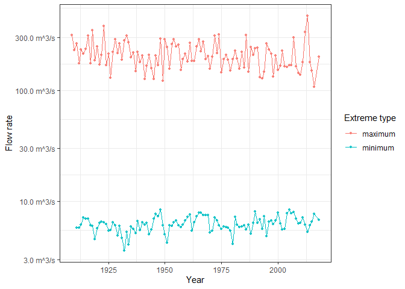
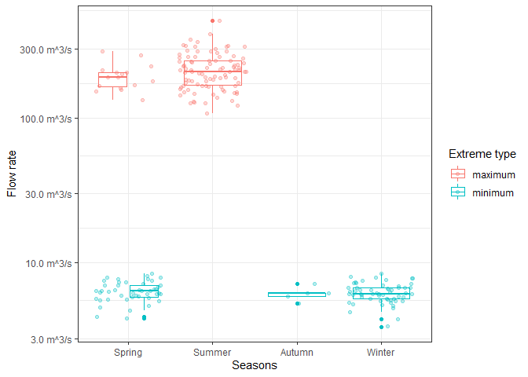
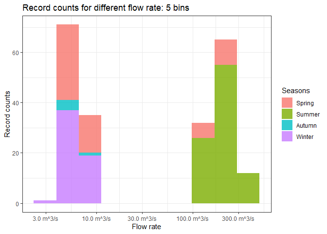

Mini Data Analysis Milestone 2
================
Eve Chen
10/12/2021

# Welcome back to my mini data analysis project!

This time, we will explore more in depth the concept of *tidy data*, and
hopefully investigate further into your research questions that you
defined in milestone 1.

**NOTE**: The main purpose of the mini data analysis is to integrate
what you learn in class in an analysis. Although each milestone provides
a framework for you to conduct your analysis, it’s possible that you
might find the instructions too rigid for your data set. If this is the
case, you may deviate from the instructions – just make sure you’re
demonstrating a wide range of tools and techniques taught in this class.

Begin by loading your data and the tidyverse package below:

``` r
library(datateachr) # <- might contain the data you picked!
library(tidyverse)
```

# Learning Objectives

By the end of this milestone, you should:

-   Become familiar with manipulating and summarizing your data in
    tibbles using `dplyr` and `tidyr`, with a research question in mind.
-   Understand what *tidy* data is, and how to create it. In milestone
    3, we will explore when this might be useful.
-   Generate a reproducible and clear report using R Markdown.
-   Gain a greater understanding of how to use R to answer research
    questions about your data.

**Things to keep in mind**

-   Remember to document your code, be explicit about what you are
    doing, and write notes in this markdown document when you feel that
    context is required. Create your analysis as if someone else will be
    reading it! **There will be 2.5 points reserved for reproducibility,
    readability, and repo organization.**

-   Before working on each task, you should always keep in mind the
    specific **research question** that you’re trying to answer.

# Task 1: Process and summarize your data (15 points)

From milestone 1, you should have an idea of the basic structure of your
dataset (e.g. number of rows and columns, class types, etc.). Here, we
will start investigating your data more in-depth using various data
manipulation functions.

### 1.1 (2.5 points)

First, write out the 4 research questions you defined in milestone 1
were. This will guide your work through milestone 2:

<!-------------------------- Start your work below ---------------------------->

**My dataset: *flow\_sample***

1.  Is there a trend (increases or decreases) of the `maximum` and
    `minimum` flow rate over time (in `years`)?
2.  How is the `maximum` and `minimum` flow rate records related to the
    month of the year?
3.  Is there *seasonality* to when `maximum` and `minimum` flow rates
    are usually recorded?
4.  There are 4 kinds of variables in column `sym`: *A: partial day, B:
    ice condtions, E: estimated, S: sample(s) collected this day, NA: no
    additional info*. How is the `flow` rate recorded possibly affected
    by these additional info?
    <!----------------------------------------------------------------------------->

### 1.2 (10 points)

Now, for each of your four research questions, choose one task from
options 1-4 (summarizing), and one other task from 4-8 (graphing). You
should have 2 tasks done for each research question (8 total). Make sure
it makes sense to do them! (e.g. don’t use a numerical variables for a
task that needs a categorical variable.). Comment on why each task helps
(or doesn’t!) answer the corresponding research question.

Ensure that the output of each operation is printed!

**Summarizing:**

1.  Compute the *range*, *mean*, and *two other summary statistics* of
    **one numerical variable** across the groups of **one categorical
    variable** from your data.
2.  Compute the number of observations for at least one of your
    categorical variables. Do not use the function `table()`!
3.  Create a categorical variable with 3 or more groups from an existing
    numerical variable. You can use this new variable in the other
    tasks! *An example: age in years into “child, teen, adult, senior”.*
4.  Based on two categorical variables, calculate two summary statistics
    of your choosing.

**Graphing:**

1.  Create a graph out of summarized variables that has at least two
    geom layers.
2.  Create a graph of your choosing, make one of the axes logarithmic,
    and format the axes labels so that they are “pretty” or easier to
    read.
3.  Make a graph where it makes sense to customize the alpha
    transparency.
4.  Create 3 histograms out of summarized variables, with each histogram
    having different sized bins. Pick the “best” one and explain why it
    is the best.

Make sure it’s clear what research question you are doing each operation
for!

<!------------------------- Start your work below ----------------------------->

#### 1.2 Operations

**1. Is there a trend (increases or decreases) of the `maximum` and
`minimum` flow rate over time (in `years`)?**

-   First, let’s filter all observasions with no flow records, and
    convert all character columns in `flow_sample` to factors. Save it
    as `flow_sample_factor`.

``` r
flow_sample_factor <- flow_sample %>%
  drop_na("flow") %>%
  mutate_if(sapply(flow_sample, is.character), as.factor)
head(flow_sample_factor)
```

    ## # A tibble: 6 x 7
    ##   station_id  year extreme_type month   day  flow sym  
    ##   <fct>      <dbl> <fct>        <dbl> <dbl> <dbl> <fct>
    ## 1 05BB001     1909 maximum          7     7   314 <NA> 
    ## 2 05BB001     1910 maximum          6    12   230 <NA> 
    ## 3 05BB001     1911 maximum          6    14   264 <NA> 
    ## 4 05BB001     1912 maximum          8    25   174 <NA> 
    ## 5 05BB001     1913 maximum          6    11   232 <NA> 
    ## 6 05BB001     1914 maximum          6    18   214 <NA>

-   (*Summarizing 1*) Now, we can compute the *range* (*max*, *min* and
    contrast) , *mean* and *median* of `flow` across the groups of
    `extream_type` from the data, to observe the overall range and
    statistical features of the flow rate recorded as different type.

``` r
flow_sample_factor %>%
  group_by(extreme_type) %>% 
  summarise(flow_maximum = max(flow),
            flow_minimum = min(flow),
            flow_range = max(flow) - min(flow),
            flow_mean = mean(flow),
            flow_median = median(flow),
            n = n())
```

    ## # A tibble: 2 x 7
    ##   extreme_type flow_maximum flow_minimum flow_range flow_mean flow_median     n
    ##   <fct>               <dbl>        <dbl>      <dbl>     <dbl>       <dbl> <int>
    ## 1 maximum            466          107        359       212.        204      109
    ## 2 minimum              8.44         3.62       4.82      6.27        6.15   107

-   Based on the statistics above, we have a clearer idea of what
    `extreme_type` indicates - `maximum` for the **biggest flow rate**
    (range from `107 m^3/s` to `466 m^3/s`) recorded that year, and
    `minimum` for the **smallest flow rate** (range from `3.62 m^3/s` to
    `8.44 m^3/s`) recorded that year. Since the range is so diverse,
    it’s better for us to always observe these two types separately.

-   (*Graphing 5*) Now we can simply take a look at the flow rate trend
    of each year based on different type - create a graph out of `flow`
    that has 2 layers: `geom_line` and `geome_point`

``` r
flow_sample_factor %>% 
  group_by(extreme_type) %>% 
  ggplot(aes(year, flow, colour = extreme_type)) +
  geom_point(size = 1, alpha = 0.8) +
  geom_line() +
  labs(x = "Year", y = "Flow rate", color = "Extreme type") +
  scale_y_continuous(labels = scales::label_number(suffix = " m^3/s")) +
  theme_bw() 
```

<!-- -->

-   From the graph above, we see that `flow` of each type is
    **fluctuating** within the range we summarized before, and there
    **isn’t** an obvious trend of the `maximum` and `minimum` flow rate
    over `year`.

**2. How is the `maximum` and `minimum` flow rate records related to the
month of the year?**

-   (*Summarizing 2*) First, I wanna compute the number of observations
    for `extreme_type` and `month` (which can also be treated as a
    categorical variable) to see if the records are evenly distributed
    in each `month`.

``` r
# How many records are there for each month:
flow_sample_factor %>%
  group_by(factor(month), extreme_type) %>% 
  count()
```

    ## # A tibble: 10 x 3
    ## # Groups:   factor(month), extreme_type [10]
    ##    `factor(month)` extreme_type     n
    ##    <fct>           <fct>        <int>
    ##  1 1               minimum         15
    ##  2 2               minimum         28
    ##  3 3               minimum         37
    ##  4 4               minimum          8
    ##  5 5               maximum         16
    ##  6 6               maximum         79
    ##  7 7               maximum         13
    ##  8 8               maximum          1
    ##  9 11              minimum          5
    ## 10 12              minimum         14

-   Surprisingly, there are only **10 rows** summarized: 0 records of
    `September` and `October`, and only 1 maximum record from `August`.
    Maximums are all recorded from `May` to `August` (5-8) while
    minimums are recorded from `November` to `April` (1-4, 11-12).

-   (*Graphing 7*) Make a graph where it makes sense to customize the
    alpha transparency. - I wanna how has the distribution of `flow`
    changed over `months` for each type of flow rate records
    (`extreme_type`). So we can plot the ridges of flow rate over
    months, and adjust the alpha transparency in case there will be
    overlapping ridges

``` r
flow_sample_factor %>% 
  ggplot(aes(flow, factor(month))) +
  ggridges::geom_density_ridges(aes(fill = extreme_type), alpha = 1/3) +
  labs(x = "Flow rate", y = "Month", fill = "Extreme type") +
  scale_x_continuous(labels = scales::label_number(suffix = " m^3/s")) +
  theme_minimal()
```

    ## Picking joint bandwidth of 8.18

<!-- -->

-   Minimum flow rate distributed recorded from month `1-4` and `11-12`
    are mostly centering around `0 m^3/s`, while the maximum rate
    recorded from month `5-7` is of higher value and widely distributed,
    mostly peak at around `150-200 m^3/s`.

**3. Is there seasonality to when maximum and minimum flow rates are
usually recorded?**

-   (*Summarizing 3*) Create a categorical variable `season` with 4
    groups from an existing numerical variable `month`.

``` r
# Create a new tibble with a new column of seasons with 4 levels from months, save as `flow_sample_season`
(flow_sample_season <- flow_sample_factor %>% 
  mutate(season = factor(case_when(month %in% c(3, 4, 5) ~ "Spring",
                                   month %in% c(6, 7, 8) ~ "Summer",
                                   month %in% c(9, 10, 11) ~ "Autumn",
                                   month %in% c(12, 1, 2) ~ "Winter"),
                         levels = c("Spring", "Summer", "Autumn", "Winter"))))
```

    ## # A tibble: 216 x 8
    ##    station_id  year extreme_type month   day  flow sym   season
    ##    <fct>      <dbl> <fct>        <dbl> <dbl> <dbl> <fct> <fct> 
    ##  1 05BB001     1909 maximum          7     7   314 <NA>  Summer
    ##  2 05BB001     1910 maximum          6    12   230 <NA>  Summer
    ##  3 05BB001     1911 maximum          6    14   264 <NA>  Summer
    ##  4 05BB001     1912 maximum          8    25   174 <NA>  Summer
    ##  5 05BB001     1913 maximum          6    11   232 <NA>  Summer
    ##  6 05BB001     1914 maximum          6    18   214 <NA>  Summer
    ##  7 05BB001     1915 maximum          6    27   236 <NA>  Summer
    ##  8 05BB001     1916 maximum          6    20   309 <NA>  Summer
    ##  9 05BB001     1917 maximum          6    17   174 <NA>  Summer
    ## 10 05BB001     1918 maximum          6    15   345 <NA>  Summer
    ## # ... with 206 more rows

``` r
# Visualize the flow rate distribution of 4 seasons.
flow_sample_season %>%
  ggplot(aes(x = season, y = flow, color = extreme_type))+
  geom_boxplot() +
  geom_jitter(aes(color = extreme_type), alpha = 0.3) +
  labs(y = "Flow rate", x= "Seasons", color = "Extreme type") +
  scale_y_continuous(labels = scales::label_number(suffix = " m^3/s")) +
  theme_bw() 
```

<!-- -->

-   (*Grapphing 4*) Create 3 histograms out of summarized variables,
    with each histogram having different sized bins. Pick the “best” one
    and explain why it is the best. - I wanna see how the `flow` rate
    collected is distributed by seasons.

-   We can first take a look at the range of the flow rate:

``` r
range(flow_sample_season$flow)
```

    ## [1]   3.62 466.00

-   The difference is approcimately `0 - 500`, so we can divide the bins
    accordingly:

``` r
# 50 bins, width around 10 each
flow_sample_season %>%
  ggplot(aes(x = flow, fill = season)) +
  geom_histogram(bins = 50, alpha = 0.8) +
  ggtitle("Record counts for different flow rate: 50 bins") +
  labs(x = "Flow rate", y = "Record counts", fill = "Seasons")+
  scale_x_continuous(labels = scales::label_number(suffix = " m^3/s")) +
  theme_bw() 
```

<!-- -->

``` r
# 10 bins, width around 50 each
flow_sample_season %>%
  ggplot(aes(x = flow, fill = season)) +
  geom_histogram(bins = 10, alpha = 0.8) +
  ggtitle("Record counts for different flow rate: 10 bins") +
  labs(x = "Flow rate", y = "Record counts", fill = "Seasons")+
  scale_x_continuous(labels = scales::label_number(suffix = " m^3/s")) +
  theme_bw() 
```

<!-- -->

``` r
# 5 bins, width around 100 each
flow_sample_season %>%
  ggplot(aes(x = flow, fill = season)) +
  geom_histogram(bins = 5, alpha = 0.8) +
  ggtitle("Record counts for different flow rate: 5 bins") +
  labs(x = "Flow rate", y = "Record counts", fill = "Seasons")+
  scale_x_continuous(labels = scales::label_number(suffix = " m^3/s")) +
  theme_bw() 
```

<!-- -->

-   The best bin size I choose is `10`. And I think any sizes as `20` or
    `25` would also look similarly well if we want to take a closer look
    of the distributions. (Here I only plotted 2 other extreme bin
    choices for comparisons).
-   With the right bin size, the resulted bins are well separated but
    not too scattered. I can observe an overall range where the `flow`
    rate collected in certain `seasons` will be distributed.

**4. There are 4 levels of variables in column `sym`: *A: partial day,
B: ice condtions, E: estimated, S: sample(s) collected this day, NA: no
additional info*. How is the `flow` rate recorded possibly affected by
these additional info?**

-   (*Summarizing 4*) Based on two categorical variables, calculate two
    summary statistics of your choosing. - I’m interested in the
    statistics about `flow` in different `extreme_type` and `sym`.

``` r
flow_sample_season %>%
  group_by(extreme_type, sym) %>%
  summarise(flow_max = max(flow),
            flow_min = min(flow),
            flow_mean = mean(flow),
            records = n())
```

    ## `summarise()` has grouped output by 'extreme_type'. You can override using the `.groups` argument.

    ## # A tibble: 6 x 6
    ## # Groups:   extreme_type [2]
    ##   extreme_type sym   flow_max flow_min flow_mean records
    ##   <fct>        <fct>    <dbl>    <dbl>     <dbl>   <int>
    ## 1 maximum      A       147      146       146.         2
    ## 2 maximum      E       220      220       220          1
    ## 3 maximum      <NA>    466      107       213.       106
    ## 4 minimum      B         8.44     3.62      6.27      95
    ## 5 minimum      E         6.43     6.43      6.43       1
    ## 6 minimum      <NA>      7.53     5.04      6.32      11

-   There are only 2 records where the flow rate is `E:estimated`, one
    for each extreme type. `A: partial day` is only with the `maximum`
    records, while `B: ice conditions` only happens when `minimum` is
    recorded.

-   (*Graphing 3*) Create a graph of your choosing, make one of the axes
    logarithmic, and format the axes labels so that they are “pretty” or
    easier to read - Based on the observations counts shown above, I
    wanna make a scatter plot of `flow` and `year`, separated by `sym`,
    to investigate how `B:ice conditions` and others affect the
    `minimum` rate recorded. And since `minimum` rates are of range
    `3.62 - 8.44`, it makes sense to transform the `flow` digits and
    labels for readability.

``` r
flow_sample_season  %>% 
  filter(extreme_type == "minimum")  %>% 
  ggplot(aes(flow, year, colour = sym)) +
  geom_point(size = 1.5, alpha = 0.8) +
  scale_x_log10(labels = scales::label_number(suffix = "m^3/s")) +
  scale_colour_discrete(labels = c('B: Ice condtions','E: Estimated','NA: No additional info')) +
  labs(x = "Flow Rate", y = "Year", colour = "Record infomation") +
  facet_wrap(~ sym, ncol = 2) +
  theme_bw() 
```

<!-- -->

-   We can see that mostly when `minimum flow` is recorded, it’s of
    `B: ice conditions` and the values recorded at `B` can ba both
    lowest or highest among all. So the record information `sym` doesn’t
    appear to have an obvious effect on the `minimum flow`

<!----------------------------------------------------------------------------->

### 1.3 (2.5 points)

Based on the operations that you’ve completed, how much closer are you
to answering your research questions? Think about what aspects of your
research questions remain unclear. Can your research questions be
refined, now that you’ve investigated your data a bit more? Which
research questions are yielding interesting results?

<!------------------------- Write your answer here ---------------------------->

-   I believe I am quite close in answering all of the questions. The
    last question on whether the `flow` is affected by `sym` still seems
    unclear at this point. It may be useful to further investigate the
    data by combining the `sym` with more information as `year`,
    `season` and `month`, and to also assess the effect on the `maximum`
    flow rates despite finite observations in non-NA levels of `sym`.

-   It may be useful to further study the `flow` trends by refining the
    data with the observations given of both the date of records and
    `sym`, so the refined question would be: **is the
    `extremum flow rate` affected by both the `year` or `season` of the
    record, and the special conditions `sym`?**

-   The relationship between the `seasons` when `maximum` and `minimum`
    flow rate are recorded is interesting. it appears `maximum` flow
    rate is almost always recorded during `summer` months and sometimes
    `spring`, whereas the majority of `minimum` flow rate happens in the
    `winter` and some in the `spring`, few in the `autumn`.

<!----------------------------------------------------------------------------->

# Task 2: Tidy your data (12.5 points)

In this task, we will do several exercises to reshape our data. The goal
here is to understand how to do this reshaping with the `tidyr` package.

A reminder of the definition of *tidy* data:

-   Each row is an **observation**
-   Each column is a **variable**
-   Each cell is a **value**

*Tidying* data is sometimes necessary because it can simplify
computation. Other times it can be nice to organize data so that it can
be easier to understand when read manually.

### 2.1 (2.5 points)

Based on the definition above, can you identify if your data is tidy or
untidy? Go through all your columns, or if you have &gt;8 variables,
just pick 8, and explain whether the data is untidy or tidy.

<!--------------------------- Start your work below --------------------------->

``` r
# Take another look of the originaldata
glimpse(flow_sample)
```

    ## Rows: 218
    ## Columns: 7
    ## $ station_id   <chr> "05BB001", "05BB001", "05BB001", "05BB001", "05BB001", "0~
    ## $ year         <dbl> 1909, 1910, 1911, 1912, 1913, 1914, 1915, 1916, 1917, 191~
    ## $ extreme_type <chr> "maximum", "maximum", "maximum", "maximum", "maximum", "m~
    ## $ month        <dbl> 7, 6, 6, 8, 6, 6, 6, 6, 6, 6, 6, 7, 6, 6, 6, 7, 5, 7, 6, ~
    ## $ day          <dbl> 7, 12, 14, 25, 11, 18, 27, 20, 17, 15, 22, 3, 9, 5, 14, 5~
    ## $ flow         <dbl> 314, 230, 264, 174, 232, 214, 236, 309, 174, 345, 185, 24~
    ## $ sym          <chr> NA, NA, NA, NA, NA, NA, NA, NA, NA, NA, NA, NA, NA, NA, N~

-   Looking at each of the variables, it seems that the data is
    **tidy**.
    -   Each row is an **observation**: Each row is a **unique** record
        with different extrema `flow` rate, `extreme_type` and record
        related information.
    -   Each column is a **variable**: All 7 variables considered, they
        are not **values**. Beside the data column `flow` and the type
        column `extreme_type`, there are 5 columns of variables. The
        `station_id` is the unique ID of the hydrometric station where
        measurements of flow is made, in this dataset all the records
        are from the same station. The recorded date is split up into
        three variables of the `year`, `month` and `day`. And additional
        information `sym` also corresponds uniquely to the observation
        itself.
    -   Each cell is a **value** - some are `NA` values.
-   However, if we only wanna know the extrema data of **each year**,
    ignoring more information as `month`, `day` and `sym` that actually
    **differs** for what time in a year when 2 types of data was
    collected, we can further tidy the data to half the size.

<!----------------------------------------------------------------------------->

### 2.2 (5 points)

Now, if your data is tidy, untidy it! Then, tidy it back to it’s
original state.

If your data is untidy, then tidy it! Then, untidy it back to it’s
original state.

Be sure to explain your reasoning for this task. Show us the “before”
and “after”.

<!--------------------------- Start your work below --------------------------->

-   Untidy *flow\_sample*: Using `values` in `extreme_type` as
    `variables` of the `flow` column, save the new tibble as
    `flow_untidy`.

``` r
# To untidy it, Use `extreme_type` as names of the `flow` column.
(flow_untidy <- 
  flow_sample %>% 
  pivot_wider(id_cols = c(-extreme_type, -flow), 
                names_from = extreme_type,
                values_from = flow))
```

    ## # A tibble: 218 x 7
    ##    station_id  year month   day sym   maximum minimum
    ##    <chr>      <dbl> <dbl> <dbl> <chr>   <dbl>   <dbl>
    ##  1 05BB001     1909     7     7 <NA>      314      NA
    ##  2 05BB001     1910     6    12 <NA>      230      NA
    ##  3 05BB001     1911     6    14 <NA>      264      NA
    ##  4 05BB001     1912     8    25 <NA>      174      NA
    ##  5 05BB001     1913     6    11 <NA>      232      NA
    ##  6 05BB001     1914     6    18 <NA>      214      NA
    ##  7 05BB001     1915     6    27 <NA>      236      NA
    ##  8 05BB001     1916     6    20 <NA>      309      NA
    ##  9 05BB001     1917     6    17 <NA>      174      NA
    ## 10 05BB001     1918     6    15 <NA>      345      NA
    ## # ... with 208 more rows

-   We can tidy this by putting `maximum` and `minimum` back into the
    same column variable: `extreme_type`. Save it as `flow_tidy`.

``` r
(flow_tidy <-
  flow_untidy %>% 
  pivot_longer(cols = c(maximum, minimum), 
               names_to = "extreme_type",
               values_to = "flow",
               values_drop_na = T)) 
```

    ## # A tibble: 216 x 7
    ##    station_id  year month   day sym   extreme_type  flow
    ##    <chr>      <dbl> <dbl> <dbl> <chr> <chr>        <dbl>
    ##  1 05BB001     1909     7     7 <NA>  maximum        314
    ##  2 05BB001     1910     6    12 <NA>  maximum        230
    ##  3 05BB001     1911     6    14 <NA>  maximum        264
    ##  4 05BB001     1912     8    25 <NA>  maximum        174
    ##  5 05BB001     1913     6    11 <NA>  maximum        232
    ##  6 05BB001     1914     6    18 <NA>  maximum        214
    ##  7 05BB001     1915     6    27 <NA>  maximum        236
    ##  8 05BB001     1916     6    20 <NA>  maximum        309
    ##  9 05BB001     1917     6    17 <NA>  maximum        174
    ## 10 05BB001     1918     6    15 <NA>  maximum        345
    ## # ... with 206 more rows

-   Dropping replicated observations with empty `flow` values would also
    drop some observations that had `NA` recorded in the original
    dataset.

<!----------------------------------------------------------------------------->

### 2.3 (5 points)

Now, you should be more familiar with your data, and also have made
progress in answering your research questions. Based on your interest,
and your analyses, pick 2 of the 4 research questions to continue your
analysis in milestone 3, and explain your decision.

Try to choose a version of your data that you think will be appropriate
to answer these 2 questions in milestone 3. Use between 4 and 8
functions that we’ve covered so far (i.e. by filtering, cleaning,
tidy’ing, dropping irrelvant columns, etc.).

<!--------------------------- Start your work below --------------------------->

-   I have chosen:

    -   1.  The refined question of question 4: is the
            `extremum flow rate` affected by both the `year` or `season`
            of the record, and the special conditions `sym`??

    After my exploratory analysis, whether the `flow` is affected by
    `sym` still remained unclear. It may be useful to further
    investigate the data by combining the `sym` with more information as
    `year`, `season` and `month`, and to also assess the effect on the
    `maximum` flow rates despite finite observations in non-NA levels of
    `sym`.

    -   1.  Is there `seasonality` (together with other factors) to when
            `maximum` and `minimum` flow rates are usually recorded and
            `flow` values differs in range?

    There was interesting results of seasonality shown to when maximum
    and minimum flow rates are recorded. It would be interesting looking
    further into of both types of `flow` data, and see if the range of
    them is related to seasonality.

<!----------------------------------------------------------------------------->

*When you are done, knit an `md` file. This is what we will mark! Make
sure to open it and check that everything has knitted correctly before
submitting your tagged release.*

### Attribution

Thanks to Victor Yuan for mostly putting this together.
